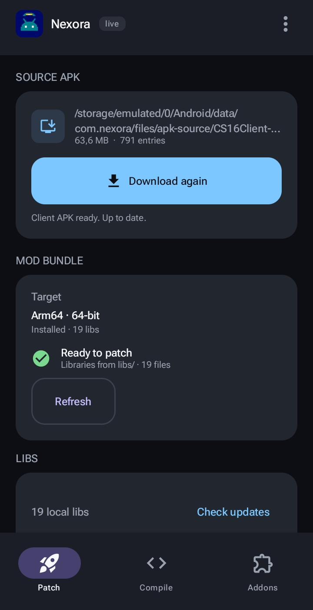
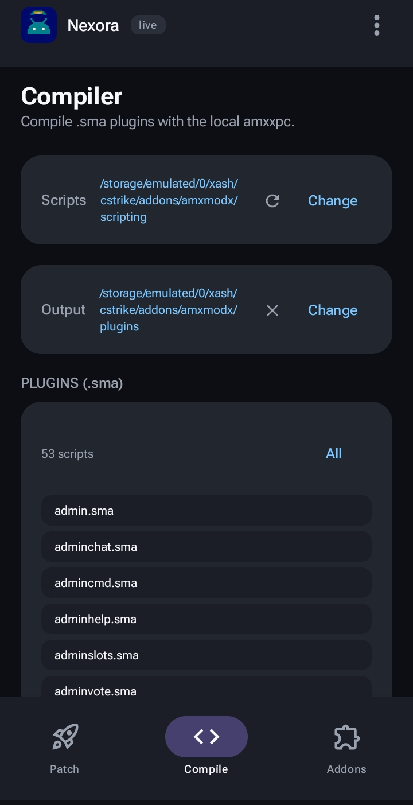
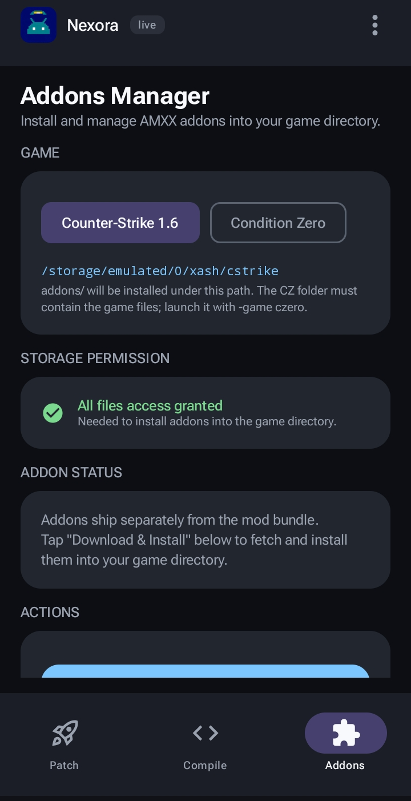
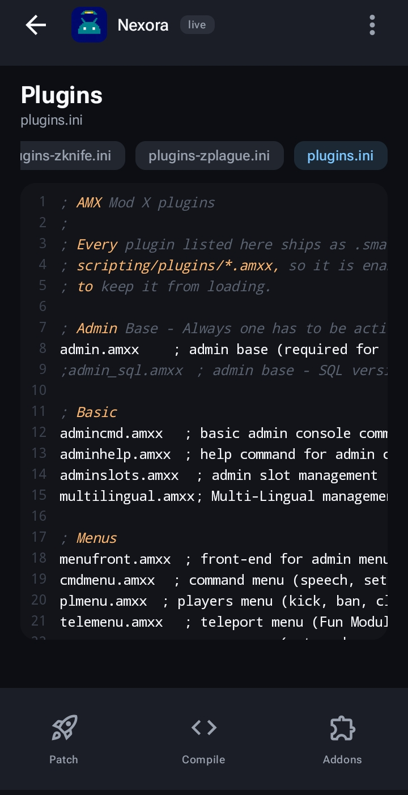
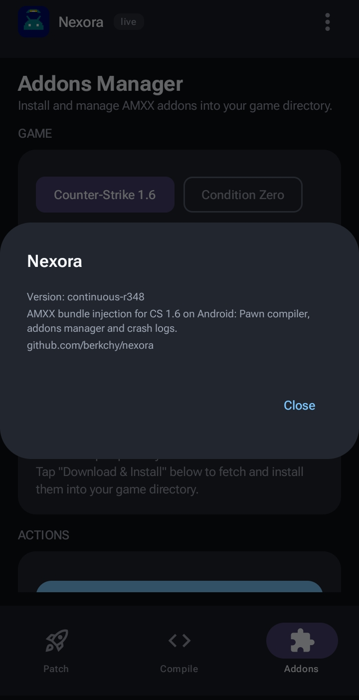

<div align="center">


# Nexora

**AMX Mod X for Counter-Strike 1.6 on Android, without touching a single build file.**

Pick your CS 1.6 APK, hit **Patch**, install the result. Metamod, AMXX, the
modules, the bot and the plugin compiler all ride along.

[](https://developer.android.com)
[](#supported-platforms)
[](#license)

</div>

---

## What it does

Nexora takes the stock CS 1.6 Android client and rewrites it into a fully
modded build. It injects the native AMXX stack, bundles a plugin compiler, and
re-signs the APK so it installs over the original.

<div align="center">
  
  
  
</div>

### The four screens

| Screen | What it's for |
|---|---|
| **Patch** | Choose the source APK, see the mod bundle status, patch, sign, install |
| **Compile** | Compile `.sma` to `.amxx` with the bundled `amxxpc` |
| **Addons** | Install and manage the AMXX addons package |
| **Plugins** | Edit `plugins.ini` without leaving the app |

<div align="center">
  
</div>

---

## Why it's built this way

### Updates instead of repatching

A patched APK is a large binary. Re-downloading 60 MB every night to change a
few `.so` files is wasteful, so Nexora publishes a **manifest** alongside the
release. On launch it compares the SHA-256 of every installed library with the
manifest and only pulls down what actually changed, then patches the APK in
place.

That means a normal update transfers a handful of megabytes, not the whole
bundle, and an interrupted update resumes instead of starting over.

### ABI-aware

Every library ships for both supported ABIs, and the manifest carries a
per-ABI manifest. The patcher picks the directory matching the device and
reports exactly what it is about to replace before it touches anything.

### Optional where it can be

Not everything has to be fatal. `libvgui2client.so` (the VGUI2 scoreboard) is
`dlopen`ed at runtime rather than linked: an APK that predates it still loads
and runs with the text scoreboard. The same reasoning applies to the engine's
MOTD support — an older engine simply renders plain text.

---

## Requirements

- **Android 8.0** (API 26) or newer
- **arm64-v8a** or **armeabi-v7a** device
- A CS 1.6 client APK — Google Play, APKMirror, or your own backup
- Storage permission to write the patched APK and the game directory

## Install

1. Download the latest APK from [Releases](https://github.com/berkchy/nexora/releases).
2. Allow **install from unknown sources** for whichever app opens it.
3. Install Nexora, then open **Patch** and select your CS 1.6 APK.
4. Patch, sign, install. Your account and game data survive — the app identity
   is preserved.

<div align="center">
  
</div>

---

## Supported platforms

| ABI | Renders as | Modules |
|---|---|---|
| `arm64-v8a` | 64-bit | `cstrike`, `csx`, `engine`, `fakemeta`, `fun`, `geoip`, `hamsandwich`, `json`, `nvault`, `reapi`, `regex`, `sockets`, `sqlite` |
| `armeabi-v7a` | 32-bit | same set |

The 64-bit build measures the ReGameDLL and engine struct offsets straight out
of the DWARF it just produced, so the shipped offset tables can never drift
from the binaries they describe.

## Building from source

CI lives in `.github/workflows/` and splits by what a commit touches:

| Marker in the commit message | Builds |
|---|---|
| `[android]` | the patcher APK |
| `[libs]` | the native bundle and manifests |
| `[android] [libs]` | both |

Cross-compilation is driven by `android/ci/build-amxx.sh`:

```sh
bash android/ci/build-amxx.sh "$PWD" "$NDK_ROOT" out
```

## License

Unlicense.

---

<div align="center">
  <sub>Counter-Strike is a trademark of Valve Corporation. This project is not
  affiliated with or endorsed by Valve.</sub>
</div>